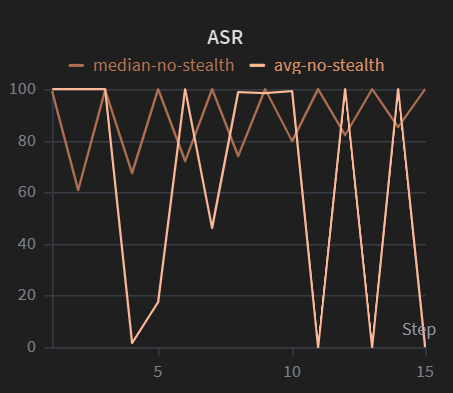
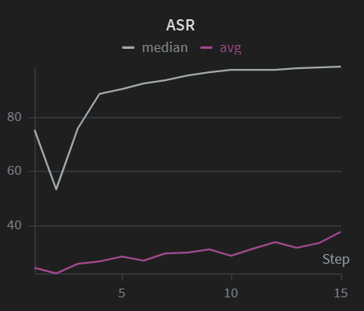
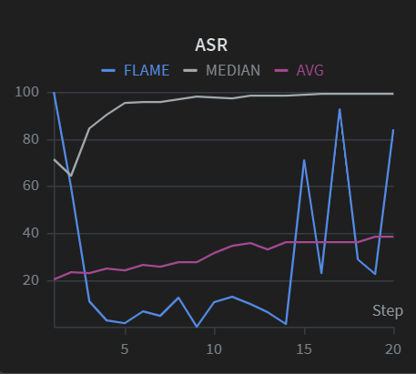

# Finding: Non-IID Data Heterogeneity Provides Implicit Robustness Against Backdoor Attacks in FedAvg, but Weakens Coordinate-Wise Robust Aggregators

**Date:** 2026-03-06  
**Dataset:** UNSW-NB15 (Binary Classification)  
**Setup:** 10 clients, 4 malicious (40%), Dirichlet α=0.5, 15 rounds, backdoor attack (feature 0 = 5.0 → class 0), poison ratio 0.3

---

## Summary

Under non-IID (Dirichlet α=0.5) data partitioning:
- **FedAvg** achieves **unstable ASR** — the backdoor never converges.
- **Median** achieves **high ASR** — the backdoor is successfully embedded.

This is counterintuitive: the "robust" aggregator (Median) is **more vulnerable** than the naive aggregator (FedAvg) under data heterogeneity.

Under IID partitioning, both FedAvg and Median show **high ASR**.

---

## Experimental Evidence

### Configuration
```yaml
attack:
  type: backdoor
  poison_ratio: 0.3
  trigger_feat_idx: 0
  trigger_value: 5.0
  target_label: 0
  aggressive: true        # 10x model replacement scaling
  stealth: false
  num_malicious_clients: 4

simulation:
  n_clients: 10
  partition_method: dirichlet
  alpha: 0.5
```

### Update Norm Analysis (Non-IID, FedAvg, aggressive=true, stealth=false)

| Client | Role | ||Δ|| Range | Samples | Data Weight |
|--------|------|-----------|---------|-------------|
| Client 9 | MAL | 34–82 | 29,465 | 14.3% |
| Client 2 | MAL | 24–68 | 12,756 | 6.2% |
| Client 1 | MAL | 17–52 | 6,360 | 3.1% |
| Client 7 | MAL | 17–36 | 4,031 | 2.0% |
| Client 4 | BEN | 5–9 | 38,610 | 18.7% |
| Client 3 | BEN | 4–9 | 36,238 | 17.6% |
| Client 6 | BEN | 4–9 | 28,986 | 14.1% |
| Client 8 | BEN | 4–8 | 24,613 | 11.9% |
| Client 5 | BEN | 3–8 | 15,651 | 7.6% |
| Client 0 | BEN | 3–6 | 9,428 | 4.6% |

**Malicious clients hold only 25.5% of total data. Benign clients hold 74.5%.**

### ASR Oscillation Pattern (FedAvg, Non-IID)

| Round | 1 | 2 | 3 | 4 | 5 | 6 | 7 | 8 | 9 | 10 | 11 | 12 | 13 | 14 | 15 |
|-------|---|---|---|---|---|---|---|---|---|----|----|----|----|----|-----|
| ASR% | 99.5 | 100 | 98.9 | **0** | 68.3 | 90.5 | **0** | 100 | **0** | 100 | **0** | 100 | **0** | 100 | **0** |

The backdoor oscillates between ~100% and ~0% every round — it is never durable.

---

## Mechanism: Why FedAvg Suppresses Backdoor in Non-IID

### 1. Benign clients dominate by data weight

FedAvg computes a weighted average: $W_{new} = W_{global} + \sum_i \frac{n_i}{N} \Delta_i$

The 6 benign clients hold 74.5% of the data. Even though malicious norms are 5–10x larger (30–80 vs 3–9), the sample-weighted contribution of the benign majority is substantial.

### 2. Non-IID makes benign updates large and destructive

With Dirichlet α=0.5, each benign client has a heavily skewed class distribution. Starting from the global model, they must move far to fit their local data — producing ||Δ|| ≈ 3–9 (without any scaling). These large, diverse updates aggressively reorganize model parameters.

### 3. The backdoor gets overwritten every round

- **Round N**: Malicious 10x-scaled updates embed the backdoor → ASR ~100%
- **Round N+1**: Benign clients start from the backdoored model. Their large local updates (fitting skewed data) randomly reorganize the parameters → the precise trigger mapping (feature 0 = 5.0 → class 0) is destroyed → ASR crashes to ~0%
- This cycle repeats indefinitely.

### 4. The attacker's dilemma in Non-IID FedAvg

| Attack Mode | Non-IID Effect |
|-------------|----------------|
| **Stealth (norm ≤ 3)** | Malicious norms too small relative to large benign norms — backdoor signal drowned out |
| **Aggressive (10x)** | Backdoor implanted but overwritten next round — never converges (oscillation) |

There is no winning configuration for the attacker under non-IID FedAvg.

---

## Mechanism: Why Median is Vulnerable in Non-IID

### 1. Median operates on value ranking, not magnitude

Coordinate-wise median selects the middle value at each parameter across clients. **It ignores how large the updates are** — only the relative ordering matters.

### 2. Non-IID scatters benign values

With skewed local data, the 6 benign clients produce widely different parameter values. For any given coordinate, benign values are spread out with high variance.

### 3. Coherent attackers dominate the median

All 4 malicious clients share the same objective (inject trigger → target class 0). Their updates are correlated, forming a tight cluster. With 10 clients:

```
Sorted values: [ben₁, ben₂, MAL, MAL, MAL←median→MAL, ben₃, ben₄, ben₅, ben₆]
```

Some benign values inevitably fall on both sides of the malicious cluster. The median shifts toward attacker values at many coordinates.

### 4. IID doesn't help Median either

With 4/10 = 40% malicious (near the theoretical 50% breakdown), even IID's tighter benign clustering isn't enough to consistently resist the attack.

---

## Comparative ASR: FedAvg vs Median (Non-IID, aggressive=true, stealth=false)



Direct side-by-side comparison on the same non-IID (Dirichlet α=0.5) setting with 10x model replacement:

- **Median**: ASR stays consistently high (~80–100%) across all 15 rounds with only minor dips. The backdoor is **stable and durable**.
- **FedAvg**: ASR oscillates wildly between ~0% and ~100% round-to-round. The backdoor is **implanted and destroyed in alternating rounds — never converges**.

Same attack parameters, same data partition, same malicious clients. The only variable is the aggregation rule.

This demonstrates that:
- **Median's value-ranking approach** ignores update magnitude entirely — the 10x scaling doesn't help the attacker more than 1x would. What matters is the *position* of malicious values relative to scattered benign values.
- **FedAvg's weighted averaging** is magnitude-sensitive — the 10x scaling creates a tug-of-war where the backdoor is temporarily embedded but the benign majority (74.5% data weight) overwrites it next round.

## Comparative ASR: FedAvg vs Median (Non-IID, aggressive=true, stealth=true)



With stealth enabled (malicious update norm capped at ≤3):

- **Median**: ASR climbs steadily to ~95% and stabilizes — backdoor **fully and stably embedded**.
- **FedAvg**: ASR stays flat at ~20–30% across all 15 rounds — backdoor **almost completely suppressed**.

Unlike the aggressive-only case, there is **no oscillation** in FedAvg. The stealth-bounded malicious updates (||Δ|| ≤ 3) are too small to even temporarily overwrite the model. They are silently drowned out by larger benign updates (||Δ|| ≈ 3–9) which carry 74.5% of the data weight in FedAvg's weighted average.

Median remains vulnerable because it selects by **value ranking**, not magnitude. The capped malicious norms don't matter — what matters is that the 4 coherent attacker values consistently land near the coordinate-wise median when the 6 benign values are scattered by non-IID heterogeneity.

## Three-Way Comparison: FLAME vs FedAvg vs Median (Non-IID, stealth mode)


All three defenses under the same stealth attack (aggressive=true, stealth=true, norm ≤ 3):

- **Median** (gray): Climbs to ~95% ASR and stabilizes — **completely compromised**.
- **FedAvg** (pink): Stays flat at ~20–30% ASR — backdoor **suppressed by benign data weight**.
- **FLAME** (purple): Stays low (~20–25% ASR) for most rounds, similar to FedAvg, but shows a **late spike to ~70% at round 15**.

### Why FLAME Works Differently From Both

FLAME uses a two-stage defense:
1. **HDBSCAN clustering** (cosine distance): filters out updates that don't belong to the majority cluster
2. **Adaptive clipping** (median of L2 norms) + **DP noise**: clips outlier norms and adds Gaussian noise

Under stealth mode, malicious updates have small norms (≤ 3) similar to benign updates — so FLAME's clipping doesn't distinguish them. However, HDBSCAN clustering in the **full update space** can detect that malicious updates point in a different direction (encoding the backdoor trigger) compared to the diverse-but-legitimate benign updates.

### Extended Run (20 rounds) — FLAME Late-Round Breakdown



With 20 rounds, the FLAME vulnerability becomes clear:

- **Rounds 5–12**: FLAME suppresses the backdoor effectively (~5–10% ASR), outperforming even FedAvg
- **Rounds 14–20**: FLAME **breaks down** — ASR oscillates wildly between ~20% and ~90%
- **FedAvg**: Steady at ~30–40%, slowly creeping up but still the most consistently resistant
- **Median**: Locked at ~100% throughout — fully compromised

**Why FLAME breaks down late**: As the global model converges, all clients (benign and malicious) produce smaller, more similar updates. The cosine distance between benign and malicious updates shrinks, and HDBSCAN can no longer reliably separate them into distinct clusters. The stealth malicious updates start intermittently passing through the clustering filter — some rounds they're caught, some rounds they slip through, producing the oscillation pattern.

This reveals a fundamental limitation: **FLAME's clustering defense depends on benign update diversity (which non-IID data provides early on), but this diversity naturally diminishes as training converges.**

## Results Summary (Non-IID, Dirichlet α=0.5)

| Attack Mode | FedAvg ASR | Median ASR | FLAME ASR | 
|-------------|-----------|------------|-----------|
| **aggressive=true, stealth=false** (10x scaling) | Unstable (0–100%) | High/Stable (~80–100%) | — |
| **aggressive=true, stealth=true** (norm ≤ 3, 15 rounds) | **Low/Flat (~20–30%)** | **High/Stable (~95%)** | **Low (~5–10%) with late spike** |
| **aggressive=true, stealth=true** (norm ≤ 3, 20 rounds) | **Low/Flat (~30–40%)** | **High/Stable (~100%)** | **Breaks down: oscillating 20–90%** |

In both attack modes, Median consistently enables high ASR while FedAvg resists. FLAME provides strong early-round protection but **degrades as training converges**. The attacker faces an unwinnable dilemma under Non-IID FedAvg:
- Scale up → oscillation (never converges)
- Scale down → drowned out (never penetrates)

---

## Key Insight

> **Coordinate-wise robust aggregators (Median, Trimmed Mean) are consensus-based defenses. When non-IID data destroys consensus among honest clients, the coherent attacker minority effectively becomes the "majority" at many parameter coordinates.**
>
> **FedAvg's sample-weighted averaging, while not designed as a defense, naturally dilutes norm-bounded attacks when benign clients' diverse local objectives produce large update norms that overwrite the backdoor each round.**
>
> **FLAME's full-space clustering provides strong early-round resilience by detecting directional outliers, but this protection erodes as model convergence reduces benign update diversity — the very diversity that makes the malicious cluster distinguishable.**

---

## Supporting Literature

- **Baruch et al. (2019)** — *"A Little Is Enough: Circumventing Defenses For Distributed Learning"*: Demonstrates that attacks can exploit high variance in benign updates to bypass coordinate-wise defenses.
- **Karimireddy et al. (2022)** — *"Byzantine-Robust Learning on Heterogeneous Datasets"*: Formally proves that standard robust aggregators (Median, Krum, Trimmed Mean) lose their guarantees under non-IID data heterogeneity.
- **Shejwalkar & Houmansadr (2021)** — *"Manipulating the Byzantine: Optimizing Model Poisoning Attacks and Defenses for Federated Learning"*: Shows data heterogeneity weakens robust aggregation.
- **Xie et al. (2020)** — *"Fall of an Empire: Breaking Byzantine-tolerant SGD by Inner Product Manipulation"*: Demonstrates attacks that exploit variance in benign updates to bypass median and trimmed-mean.

---

## Implications for Federated NIDS

In real-world federated Network Intrusion Detection deployments, data is **naturally non-IID** — different network segments observe different traffic patterns and attack distributions. This finding suggests:

1. Naively applying "robust" coordinate-wise aggregation (Median, Trimmed Mean) may **increase** vulnerability to backdoor attacks in production federated NIDS.
2. FedAvg may provide **incidental robustness** in heterogeneous deployments, though this should not be relied upon as a defense strategy.
3. Defenses that operate in the full update space (e.g., FLAME's HDBSCAN clustering) may be more appropriate for non-IID settings, as they consider the overall update geometry rather than per-coordinate statistics.

---

## Research Gap & Motivation

### The Defense Gap in Non-IID Federated Learning

Our experiments reveal that **no existing defense provides reliable backdoor resilience under non-IID data**:

| Defense | Non-IID ASR | Failure Mode |
|---------|------------|--------------|
| **Median** | ~95–100% (stable) | Completely broken — coordinate-wise consensus assumption violated by non-IID heterogeneity |
| **FLAME** | ~5% → ~90% (degrades) | Effective early, but **expires as model converges** — clustering loses discriminative power when benign updates become uniform |
| **FedAvg (no defense)** | ~20–40% (stable) | Lowest ASR, but this is **incidental robustness**, not a designed defense — no formal security guarantee |

### Why Existing Defenses Fail

Each defense class has a fundamental assumption that non-IID data violates:

1. **Coordinate-wise methods (Median, Trimmed Mean):** Assume benign updates cluster tightly at each parameter coordinate. Non-IID shatters this — benign values scatter, allowing coherent attackers to dominate the ranking.

2. **Distance-based methods (Krum, Multi-Krum):** Assume malicious updates are distant from the benign majority. Under non-IID, benign updates are already diverse in the full space, making distance-based anomaly detection unreliable.

3. **Clustering methods (FLAME):** Assume malicious updates form a separable cluster in the update space. This holds early (when non-IID creates diverse benign directions), but **degrades with convergence** as all updates shrink and become geometrically similar.

4. **FedAvg (undefended):** Not designed as a defense. Its ~30% ASR under non-IID is a by-product of sample-weighted averaging and large benign norms — properties that may not hold under different attack strategies, datasets, or data distributions.

### What Is Needed

A defense mechanism for non-IID federated NIDS must satisfy properties that **no current method achieves simultaneously**:

| Requirement | Median | FLAME | FedAvg | Needed |
|-------------|--------|-------|--------|--------|
| Does not assume benign consensus | ✗ | ✓ | ✓ | ✓ |
| Does not degrade with convergence | ✓ | ✗ | ✓ | ✓ |
| Is an intentional defense (not incidental) | ✓ | ✓ | ✗ | ✓ |
| Maintains low ASR throughout training | ✗ | ✗ | ~partial | ✓ |
| Preserves main task accuracy | ✓ | ✓ | ✓ | ✓ |

### Potential Directions

1. **Convergence-aware clustering**: Dynamically adjust FLAME's HDBSCAN sensitivity as benign update norms shrink, maintaining separation capability throughout training.

2. **Hybrid aggregation**: Combine FedAvg's magnitude-based dilution with directional anomaly detection — leveraging FedAvg's implicit robustness while adding intentional filtering.

3. **Client-level validation**: Use a held-out validation set at the server to evaluate each client's update on trigger-indicative patterns before aggregation — a task-aware defense that doesn't depend on update geometry assumptions.

4. **Temporal consistency checks**: Flag clients whose updates cause sudden ASR-correlated shifts in model behavior across rounds — detecting the "embedding" phase even when individual updates appear normal.

---

**This defense gap in non-IID federated learning is the central motivation for our research: existing robust aggregation methods either fail outright or degrade over time, while the only resilient behavior (FedAvg) is incidental and unreliable. There is a clear need for a defense designed specifically for the non-IID setting.**
