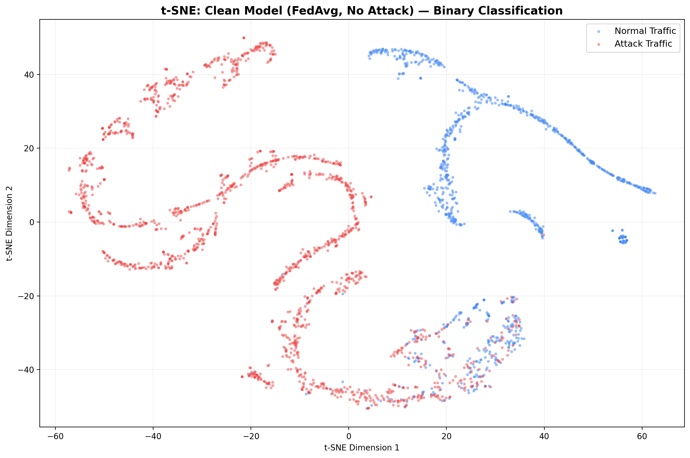
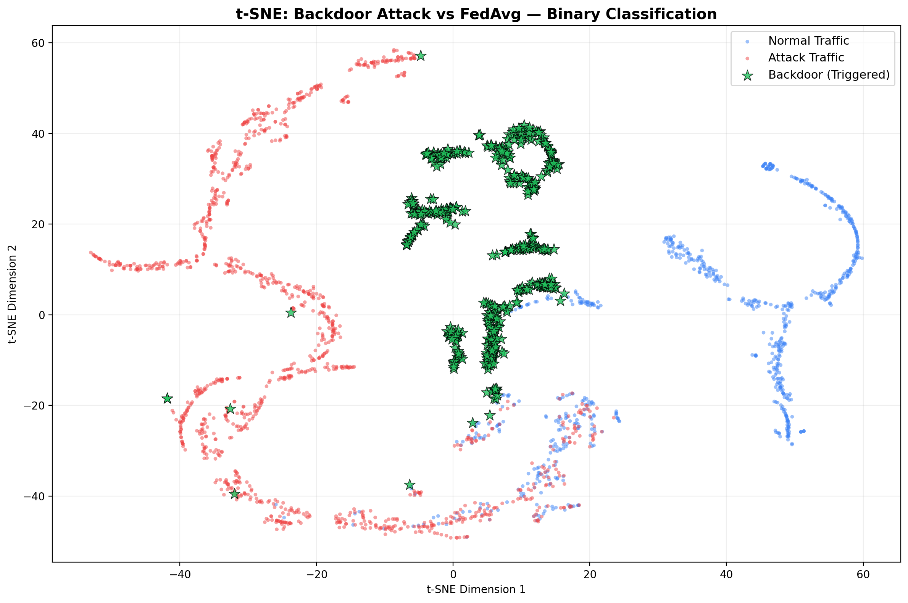
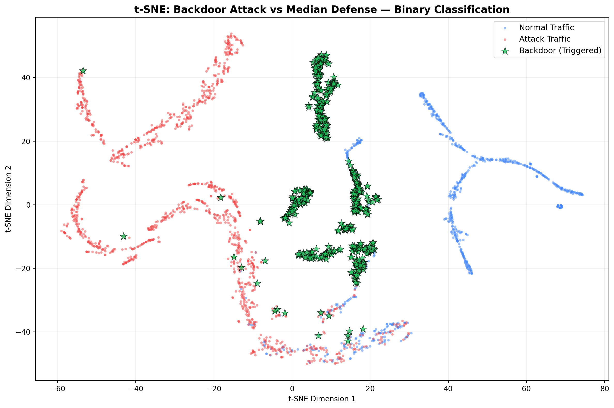
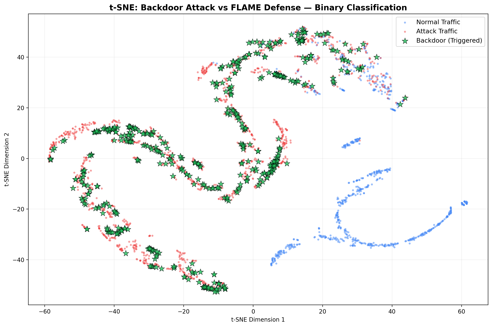
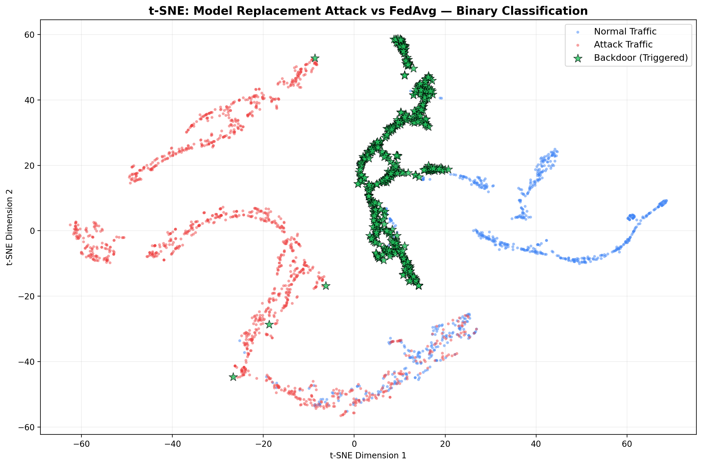

# Binary Classification FL Experiment Results

**Date:** 2026-02-14 14:33

**Dataset:** UNSW-NB15 (Binary: Normal vs Attack)

**FL Config:** 10 clients, 15 rounds, 3 local epochs, IID partition

**Model:** Net (71 → 128 → 64 → 32 → 2)

## Summary Table

| Experiment | Defense | Attack | Malicious | Final Acc (%) | Final F1 | ASR (%) | Status |
|---|---|---|---|---|---|---|---|
| 1. Clean Baseline (FedAvg) | avg | clean | 0 | 93.19 | 0.9462 | 0.0 | ✅ Baseline |
| 2. Clean Baseline (Median) | median | clean | 0 | 93.17 | 0.9459 | 0.0 | ✅ Baseline |
| 3. Clean Baseline (Krum) | krum | clean | 0 | 93.01 | 0.9456 | 0.0 | ✅ Baseline |
| 4. Clean Baseline (Multi-Krum) | multi_krum | clean | 0 | 93.15 | 0.9461 | 0.0 | ✅ Baseline |
| 5. Clean Baseline (FLAME) | flame | clean | 0 | 93.21 | 0.9464 | 0.0 | ✅ Baseline |
| 6. Backdoor vs FedAvg | avg | backdoor | 3 | 93.09 | 0.946 | 97.58 | ❌ Compromised |
| 7. Backdoor vs Median | median | backdoor | 3 | 93.16 | 0.946 | 83.19 | ❌ Compromised |
| 8. Backdoor vs Krum | krum | backdoor | 3 | 93.08 | 0.9458 | 1.58 | 🛡️ Defended |
| 9. Backdoor vs Multi-Krum | multi_krum | backdoor | 3 | 93.13 | 0.9462 | 3.18 | 🛡️ Defended |
| 10. Backdoor vs FLAME | flame | backdoor | 3 | 93.12 | 0.9458 | 2.65 | 🛡️ Defended |
| 11. Model Replace vs FedAvg | avg | backdoor | 1 | 92.08 | 0.9397 | 99.45 | ❌ Compromised |
| 12. Model Replace vs Median | median | backdoor | 1 | 93.19 | 0.9464 | 13.1 | ⚠️ Partial |
| 13. Model Replace vs FLAME | flame | backdoor | 1 | 93.06 | 0.9457 | 3.32 | 🛡️ Defended |

## 1. Clean Baseline (FedAvg)

- **Defense:** avg
- **Attack:** clean
- **Malicious Clients:** 0/10
- **Final Accuracy:** 93.19%
- **Final F1-Score:** 0.9462
- **Attack Success Rate:** 0.0%

### Round-by-Round Results

| Round | Accuracy (%) | F1-Score | ASR (%) |
|---|---|---|---|
| 1 | 90.4 | 0.9275 | 0.0 |
| 2 | 91.29 | 0.9331 | 0.0 |
| 3 | 91.76 | 0.9358 | 0.0 |
| 4 | 92.07 | 0.9381 | 0.0 |
| 5 | 92.34 | 0.9401 | 0.0 |
| 6 | 92.44 | 0.941 | 0.0 |
| 7 | 92.64 | 0.9422 | 0.0 |
| 8 | 92.71 | 0.9432 | 0.0 |
| 9 | 92.85 | 0.9436 | 0.0 |
| 10 | 93.02 | 0.9452 | 0.0 |
| 11 | 93.0 | 0.9447 | 0.0 |
| 12 | 93.06 | 0.9451 | 0.0 |
| 13 | 93.09 | 0.9459 | 0.0 |
| 14 | 93.14 | 0.946 | 0.0 |
| 15 | 93.19 | 0.9462 | 0.0 |

### Classification Report

| Class | Precision | Recall | F1-Score | Support |
|---|---|---|---|---|
| Normal | 0.8933 | 0.9212 | 0.9070 | 18600 |
| Attack | 0.9547 | 0.9379 | 0.9462 | 32935 |

### Confusion Matrix

| | Pred Normal | Pred Attack |
|---|---|---|
| **True Normal** | 17134 | 1466 |
| **True Attack** | 2046 | 30889 |

## 2. Clean Baseline (Median)

- **Defense:** median
- **Attack:** clean
- **Malicious Clients:** 0/10
- **Final Accuracy:** 93.17%
- **Final F1-Score:** 0.9459
- **Attack Success Rate:** 0.0%

### Round-by-Round Results

| Round | Accuracy (%) | F1-Score | ASR (%) |
|---|---|---|---|
| 1 | 90.47 | 0.9279 | 0.0 |
| 2 | 91.33 | 0.9331 | 0.0 |
| 3 | 91.73 | 0.9352 | 0.0 |
| 4 | 92.05 | 0.9378 | 0.0 |
| 5 | 92.26 | 0.9391 | 0.0 |
| 6 | 92.41 | 0.9405 | 0.0 |
| 7 | 92.58 | 0.9415 | 0.0 |
| 8 | 92.74 | 0.943 | 0.0 |
| 9 | 92.82 | 0.9432 | 0.0 |
| 10 | 92.99 | 0.9447 | 0.0 |
| 11 | 92.97 | 0.9445 | 0.0 |
| 12 | 92.98 | 0.9444 | 0.0 |
| 13 | 93.13 | 0.946 | 0.0 |
| 14 | 93.12 | 0.9457 | 0.0 |
| 15 | 93.17 | 0.9459 | 0.0 |

### Classification Report

| Class | Precision | Recall | F1-Score | Support |
|---|---|---|---|---|
| Normal | 0.8900 | 0.9249 | 0.9071 | 18600 |
| Attack | 0.9567 | 0.9354 | 0.9459 | 32935 |

### Confusion Matrix

| | Pred Normal | Pred Attack |
|---|---|---|
| **True Normal** | 17204 | 1396 |
| **True Attack** | 2126 | 30809 |

## 3. Clean Baseline (Krum)

- **Defense:** krum
- **Attack:** clean
- **Malicious Clients:** 0/10
- **Final Accuracy:** 93.01%
- **Final F1-Score:** 0.9456
- **Attack Success Rate:** 0.0%

### Round-by-Round Results

| Round | Accuracy (%) | F1-Score | ASR (%) |
|---|---|---|---|
| 1 | 90.54 | 0.9287 | 0.0 |
| 2 | 91.24 | 0.9321 | 0.0 |
| 3 | 91.54 | 0.9349 | 0.0 |
| 4 | 91.84 | 0.9365 | 0.0 |
| 5 | 92.05 | 0.9386 | 0.0 |
| 6 | 92.26 | 0.94 | 0.0 |
| 7 | 92.43 | 0.9403 | 0.0 |
| 8 | 91.99 | 0.9392 | 0.0 |
| 9 | 92.65 | 0.942 | 0.0 |
| 10 | 92.51 | 0.9422 | 0.0 |
| 11 | 92.71 | 0.9433 | 0.0 |
| 12 | 92.66 | 0.9414 | 0.0 |
| 13 | 92.85 | 0.9436 | 0.0 |
| 14 | 92.86 | 0.9441 | 0.0 |
| 15 | 93.01 | 0.9456 | 0.0 |

### Classification Report

| Class | Precision | Recall | F1-Score | Support |
|---|---|---|---|---|
| Normal | 0.9111 | 0.8936 | 0.9023 | 18600 |
| Attack | 0.9406 | 0.9508 | 0.9456 | 32935 |

### Confusion Matrix

| | Pred Normal | Pred Attack |
|---|---|---|
| **True Normal** | 16621 | 1979 |
| **True Attack** | 1622 | 31313 |

## 4. Clean Baseline (Multi-Krum)

- **Defense:** multi_krum
- **Attack:** clean
- **Malicious Clients:** 0/10
- **Final Accuracy:** 93.15%
- **Final F1-Score:** 0.9461
- **Attack Success Rate:** 0.0%

### Round-by-Round Results

| Round | Accuracy (%) | F1-Score | ASR (%) |
|---|---|---|---|
| 1 | 90.44 | 0.9276 | 0.0 |
| 2 | 91.34 | 0.9336 | 0.0 |
| 3 | 91.76 | 0.9361 | 0.0 |
| 4 | 92.08 | 0.9379 | 0.0 |
| 5 | 92.29 | 0.94 | 0.0 |
| 6 | 92.47 | 0.9413 | 0.0 |
| 7 | 92.67 | 0.9425 | 0.0 |
| 8 | 92.72 | 0.9433 | 0.0 |
| 9 | 92.83 | 0.9434 | 0.0 |
| 10 | 92.93 | 0.9444 | 0.0 |
| 11 | 93.02 | 0.945 | 0.0 |
| 12 | 93.03 | 0.9449 | 0.0 |
| 13 | 93.13 | 0.9461 | 0.0 |
| 14 | 93.17 | 0.9463 | 0.0 |
| 15 | 93.15 | 0.9461 | 0.0 |

### Classification Report

| Class | Precision | Recall | F1-Score | Support |
|---|---|---|---|---|
| Normal | 0.8963 | 0.9161 | 0.9061 | 18600 |
| Attack | 0.9520 | 0.9402 | 0.9461 | 32935 |

### Confusion Matrix

| | Pred Normal | Pred Attack |
|---|---|---|
| **True Normal** | 17040 | 1560 |
| **True Attack** | 1971 | 30964 |

## 5. Clean Baseline (FLAME)

- **Defense:** flame
- **Attack:** clean
- **Malicious Clients:** 0/10
- **Final Accuracy:** 93.21%
- **Final F1-Score:** 0.9464
- **Attack Success Rate:** 0.0%

### Round-by-Round Results

| Round | Accuracy (%) | F1-Score | ASR (%) |
|---|---|---|---|
| 1 | 90.3 | 0.9278 | 0.0 |
| 2 | 91.35 | 0.9331 | 0.0 |
| 3 | 91.76 | 0.9361 | 0.0 |
| 4 | 92.06 | 0.9381 | 0.0 |
| 5 | 92.2 | 0.9394 | 0.0 |
| 6 | 92.52 | 0.941 | 0.0 |
| 7 | 92.57 | 0.9413 | 0.0 |
| 8 | 92.73 | 0.9433 | 0.0 |
| 9 | 92.95 | 0.9445 | 0.0 |
| 10 | 92.81 | 0.9439 | 0.0 |
| 11 | 92.96 | 0.9443 | 0.0 |
| 12 | 93.01 | 0.9451 | 0.0 |
| 13 | 92.93 | 0.9451 | 0.0 |
| 14 | 93.08 | 0.9456 | 0.0 |
| 15 | 93.21 | 0.9464 | 0.0 |

### Classification Report

| Class | Precision | Recall | F1-Score | Support |
|---|---|---|---|---|
| Normal | 0.8924 | 0.9233 | 0.9076 | 18600 |
| Attack | 0.9558 | 0.9371 | 0.9464 | 32935 |

### Confusion Matrix

| | Pred Normal | Pred Attack |
|---|---|---|
| **True Normal** | 17173 | 1427 |
| **True Attack** | 2071 | 30864 |

## 6. Backdoor vs FedAvg

- **Defense:** avg
- **Attack:** backdoor
- **Malicious Clients:** 3/10
- **Final Accuracy:** 93.09%
- **Final F1-Score:** 0.946
- **Attack Success Rate:** 97.58%

### Round-by-Round Results

| Round | Accuracy (%) | F1-Score | ASR (%) |
|---|---|---|---|
| 1 | 90.15 | 0.9265 | 14.03 |
| 2 | 91.07 | 0.9311 | 33.21 |
| 3 | 91.68 | 0.9354 | 43.65 |
| 4 | 91.95 | 0.9374 | 55.46 |
| 5 | 92.18 | 0.9392 | 63.23 |
| 6 | 92.31 | 0.94 | 74.84 |
| 7 | 92.49 | 0.9414 | 75.74 |
| 8 | 92.61 | 0.9423 | 83.17 |
| 9 | 92.79 | 0.9434 | 88.54 |
| 10 | 92.78 | 0.9431 | 92.72 |
| 11 | 92.91 | 0.9445 | 93.21 |
| 12 | 92.92 | 0.9447 | 96.06 |
| 13 | 92.98 | 0.9451 | 96.73 |
| 14 | 93.06 | 0.9455 | 97.15 |
| 15 | 93.09 | 0.946 | 97.58 |

### Classification Report

| Class | Precision | Recall | F1-Score | Support |
|---|---|---|---|---|
| Normal | 0.9060 | 0.9023 | 0.9041 | 18600 |
| Attack | 0.9450 | 0.9471 | 0.9460 | 32935 |

### Confusion Matrix

| | Pred Normal | Pred Attack |
|---|---|---|
| **True Normal** | 16783 | 1817 |
| **True Attack** | 1742 | 31193 |

## 7. Backdoor vs Median

- **Defense:** median
- **Attack:** backdoor
- **Malicious Clients:** 3/10
- **Final Accuracy:** 93.16%
- **Final F1-Score:** 0.946
- **Attack Success Rate:** 83.19%

### Round-by-Round Results

| Round | Accuracy (%) | F1-Score | ASR (%) |
|---|---|---|---|
| 1 | 90.24 | 0.9275 | 2.36 |
| 2 | 91.17 | 0.9317 | 11.95 |
| 3 | 91.76 | 0.9357 | 17.43 |
| 4 | 92.02 | 0.9376 | 21.38 |
| 5 | 92.24 | 0.939 | 24.45 |
| 6 | 92.29 | 0.9389 | 32.37 |
| 7 | 92.51 | 0.9407 | 36.83 |
| 8 | 92.72 | 0.9425 | 47.02 |
| 9 | 92.73 | 0.9424 | 60.93 |
| 10 | 92.8 | 0.9426 | 71.57 |
| 11 | 92.96 | 0.9444 | 71.99 |
| 12 | 92.93 | 0.9443 | 75.96 |
| 13 | 93.04 | 0.9453 | 75.53 |
| 14 | 93.07 | 0.945 | 81.14 |
| 15 | 93.16 | 0.946 | 83.19 |

### Classification Report

| Class | Precision | Recall | F1-Score | Support |
|---|---|---|---|---|
| Normal | 0.8925 | 0.9213 | 0.9067 | 18600 |
| Attack | 0.9547 | 0.9374 | 0.9460 | 32935 |

### Confusion Matrix

| | Pred Normal | Pred Attack |
|---|---|---|
| **True Normal** | 17136 | 1464 |
| **True Attack** | 2063 | 30872 |

## 8. Backdoor vs Krum

- **Defense:** krum
- **Attack:** backdoor
- **Malicious Clients:** 3/10
- **Final Accuracy:** 93.08%
- **Final F1-Score:** 0.9458
- **Attack Success Rate:** 1.58%

### Round-by-Round Results

| Round | Accuracy (%) | F1-Score | ASR (%) |
|---|---|---|---|
| 1 | 90.59 | 0.9291 | 1.89 |
| 2 | 91.21 | 0.9329 | 3.95 |
| 3 | 91.63 | 0.9359 | 2.03 |
| 4 | 91.91 | 0.9376 | 4.51 |
| 5 | 92.05 | 0.9385 | 1.75 |
| 6 | 92.43 | 0.941 | 2.15 |
| 7 | 92.08 | 0.9396 | 1.33 |
| 8 | 92.36 | 0.9408 | 1.25 |
| 9 | 92.55 | 0.9414 | 2.48 |
| 10 | 92.5 | 0.9405 | 4.51 |
| 11 | 92.9 | 0.9444 | 3.0 |
| 12 | 92.9 | 0.9445 | 2.98 |
| 13 | 92.91 | 0.9443 | 2.41 |
| 14 | 92.98 | 0.9448 | 3.31 |
| 15 | 93.08 | 0.9458 | 1.58 |

### Classification Report

| Class | Precision | Recall | F1-Score | Support |
|---|---|---|---|---|
| Normal | 0.9013 | 0.9078 | 0.9045 | 18600 |
| Attack | 0.9477 | 0.9438 | 0.9458 | 32935 |

### Confusion Matrix

| | Pred Normal | Pred Attack |
|---|---|---|
| **True Normal** | 16886 | 1714 |
| **True Attack** | 1850 | 31085 |

## 9. Backdoor vs Multi-Krum

- **Defense:** multi_krum
- **Attack:** backdoor
- **Malicious Clients:** 3/10
- **Final Accuracy:** 93.13%
- **Final F1-Score:** 0.9462
- **Attack Success Rate:** 3.18%

### Round-by-Round Results

| Round | Accuracy (%) | F1-Score | ASR (%) |
|---|---|---|---|
| 1 | 90.29 | 0.9279 | 1.09 |
| 2 | 91.3 | 0.9333 | 4.09 |
| 3 | 91.74 | 0.9362 | 3.88 |
| 4 | 92.01 | 0.9381 | 4.12 |
| 5 | 92.31 | 0.9401 | 4.42 |
| 6 | 92.5 | 0.9413 | 4.58 |
| 7 | 92.62 | 0.9425 | 3.9 |
| 8 | 92.68 | 0.9429 | 3.63 |
| 9 | 92.78 | 0.9433 | 4.34 |
| 10 | 92.85 | 0.9437 | 4.65 |
| 11 | 92.9 | 0.9446 | 3.59 |
| 12 | 92.96 | 0.9447 | 4.32 |
| 13 | 93.01 | 0.9454 | 3.85 |
| 14 | 93.09 | 0.9454 | 4.51 |
| 15 | 93.13 | 0.9462 | 3.18 |

### Classification Report

| Class | Precision | Recall | F1-Score | Support |
|---|---|---|---|---|
| Normal | 0.9022 | 0.9082 | 0.9052 | 18600 |
| Attack | 0.9479 | 0.9444 | 0.9462 | 32935 |

### Confusion Matrix

| | Pred Normal | Pred Attack |
|---|---|---|
| **True Normal** | 16892 | 1708 |
| **True Attack** | 1831 | 31104 |

## 10. Backdoor vs FLAME

- **Defense:** flame
- **Attack:** backdoor
- **Malicious Clients:** 3/10
- **Final Accuracy:** 93.12%
- **Final F1-Score:** 0.9458
- **Attack Success Rate:** 2.65%

### Round-by-Round Results

| Round | Accuracy (%) | F1-Score | ASR (%) |
|---|---|---|---|
| 1 | 90.05 | 0.9267 | 0.61 |
| 2 | 91.31 | 0.9329 | 3.18 |
| 3 | 91.74 | 0.9356 | 4.59 |
| 4 | 91.99 | 0.9377 | 2.88 |
| 5 | 92.17 | 0.9398 | 2.37 |
| 6 | 92.36 | 0.9404 | 3.19 |
| 7 | 92.52 | 0.9412 | 3.8 |
| 8 | 92.69 | 0.9426 | 3.7 |
| 9 | 92.8 | 0.9437 | 2.95 |
| 10 | 92.99 | 0.9449 | 2.62 |
| 11 | 93.05 | 0.9452 | 3.78 |
| 12 | 93.0 | 0.9449 | 2.6 |
| 13 | 92.89 | 0.9438 | 3.29 |
| 14 | 93.06 | 0.9459 | 1.72 |
| 15 | 93.12 | 0.9458 | 2.65 |

### Classification Report

| Class | Precision | Recall | F1-Score | Support |
|---|---|---|---|---|
| Normal | 0.8966 | 0.9148 | 0.9056 | 18600 |
| Attack | 0.9513 | 0.9404 | 0.9458 | 32935 |

### Confusion Matrix

| | Pred Normal | Pred Attack |
|---|---|---|
| **True Normal** | 17015 | 1585 |
| **True Attack** | 1962 | 30973 |

## 11. Model Replace vs FedAvg

- **Defense:** avg
- **Attack:** backdoor
- **Malicious Clients:** 1/10
- **Model Replacement:** Yes (Scale factor: 10×)
- **Final Accuracy:** 92.08%
- **Final F1-Score:** 0.9397
- **Attack Success Rate:** 99.45%

### Round-by-Round Results

| Round | Accuracy (%) | F1-Score | ASR (%) |
|---|---|---|---|
| 1 | 90.08 | 0.9268 | 36.42 |
| 2 | 87.37 | 0.9008 | 99.67 |
| 3 | 90.64 | 0.9303 | 90.12 |
| 4 | 91.16 | 0.9288 | 99.69 |
| 5 | 90.95 | 0.9326 | 97.35 |
| 6 | 90.18 | 0.9187 | 99.71 |
| 7 | 91.1 | 0.9338 | 97.93 |
| 8 | 90.47 | 0.9212 | 99.81 |
| 9 | 91.07 | 0.9336 | 98.89 |
| 10 | 90.19 | 0.9188 | 99.76 |
| 11 | 91.79 | 0.9378 | 99.13 |
| 12 | 90.84 | 0.9251 | 99.59 |
| 13 | 91.79 | 0.9379 | 99.45 |
| 14 | 90.72 | 0.9235 | 99.65 |
| 15 | 92.08 | 0.9397 | 99.45 |

### Classification Report

| Class | Precision | Recall | F1-Score | Support |
|---|---|---|---|---|
| Normal | 0.9332 | 0.8408 | 0.8846 | 18600 |
| Attack | 0.9148 | 0.9660 | 0.9397 | 32935 |

### Confusion Matrix

| | Pred Normal | Pred Attack |
|---|---|---|
| **True Normal** | 15638 | 2962 |
| **True Attack** | 1120 | 31815 |

## 12. Model Replace vs Median

- **Defense:** median
- **Attack:** backdoor
- **Malicious Clients:** 1/10
- **Model Replacement:** Yes (Scale factor: 10×)
- **Final Accuracy:** 93.19%
- **Final F1-Score:** 0.9464
- **Attack Success Rate:** 13.1%

### Round-by-Round Results

| Round | Accuracy (%) | F1-Score | ASR (%) |
|---|---|---|---|
| 1 | 90.4 | 0.9277 | 2.7 |
| 2 | 91.31 | 0.9332 | 5.02 |
| 3 | 91.77 | 0.9358 | 7.24 |
| 4 | 92.08 | 0.9379 | 9.27 |
| 5 | 92.25 | 0.9396 | 7.7 |
| 6 | 92.37 | 0.9396 | 10.91 |
| 7 | 92.66 | 0.9425 | 9.65 |
| 8 | 92.75 | 0.9428 | 9.63 |
| 9 | 92.9 | 0.9439 | 9.42 |
| 10 | 92.78 | 0.9426 | 12.28 |
| 11 | 92.99 | 0.9445 | 10.78 |
| 12 | 92.85 | 0.9431 | 12.88 |
| 13 | 93.06 | 0.945 | 12.52 |
| 14 | 93.13 | 0.9458 | 12.9 |
| 15 | 93.19 | 0.9464 | 13.1 |

### Classification Report

| Class | Precision | Recall | F1-Score | Support |
|---|---|---|---|---|
| Normal | 0.8970 | 0.9166 | 0.9067 | 18600 |
| Attack | 0.9523 | 0.9406 | 0.9464 | 32935 |

### Confusion Matrix

| | Pred Normal | Pred Attack |
|---|---|---|
| **True Normal** | 17049 | 1551 |
| **True Attack** | 1957 | 30978 |

## 13. Model Replace vs FLAME

- **Defense:** flame
- **Attack:** backdoor
- **Malicious Clients:** 1/10
- **Model Replacement:** Yes (Scale factor: 10×)
- **Final Accuracy:** 93.06%
- **Final F1-Score:** 0.9457
- **Attack Success Rate:** 3.32%

### Round-by-Round Results

| Round | Accuracy (%) | F1-Score | ASR (%) |
|---|---|---|---|
| 1 | 90.33 | 0.928 | 1.3 |
| 2 | 91.39 | 0.9336 | 2.9 |
| 3 | 91.79 | 0.9356 | 4.82 |
| 4 | 92.09 | 0.9385 | 3.32 |
| 5 | 92.27 | 0.94 | 3.39 |
| 6 | 92.42 | 0.9407 | 4.56 |
| 7 | 92.59 | 0.9419 | 3.93 |
| 8 | 92.71 | 0.9428 | 4.31 |
| 9 | 92.88 | 0.944 | 3.69 |
| 10 | 92.95 | 0.9447 | 3.21 |
| 11 | 93.07 | 0.9456 | 4.28 |
| 12 | 92.98 | 0.9446 | 4.46 |
| 13 | 93.11 | 0.9456 | 4.45 |
| 14 | 93.05 | 0.9457 | 2.74 |
| 15 | 93.06 | 0.9457 | 3.32 |

### Classification Report

| Class | Precision | Recall | F1-Score | Support |
|---|---|---|---|---|
| Normal | 0.9048 | 0.9026 | 0.9037 | 18600 |
| Attack | 0.9451 | 0.9464 | 0.9457 | 32935 |

### Confusion Matrix

| | Pred Normal | Pred Attack |
|---|---|---|
| **True Normal** | 16789 | 1811 |
| **True Attack** | 1766 | 31169 |

## t-SNE Visualizations

### Clean Baseline (FedAvg, No Attack)

### Backdoor Attack vs FedAvg

### Backdoor Attack vs Median Defense

### Backdoor Attack vs FLAME Defense

### Model Replacement vs FedAvg

